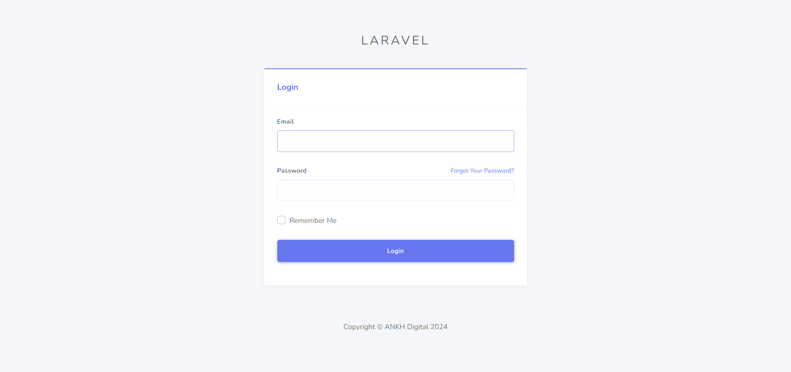
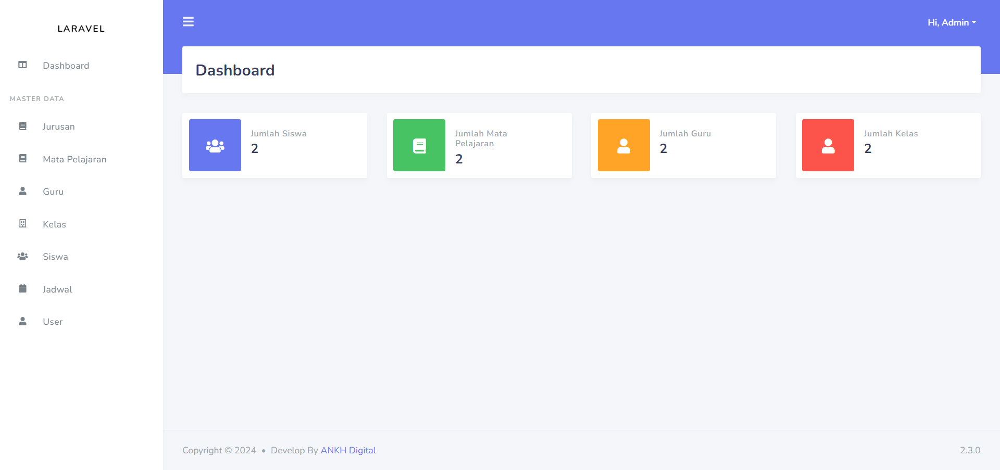

# Sistem Informasi Siswa Terpadu | Laravel + Bostraps

Sistem Informasi yang di peruntukkan untuk siswa yang meliputi segala data data terkait akademik yang bersifat Informasi

## Fitur

- Dashboard
- Data Siswa
- Data Guru
- Data Mata pelajaraan
- Data Kelas
- Data Jadwal

## Teknologi

**Fornt-End:** HTML, CSS, JavaScript, Bootstrap 

**Framework:** PHP, Laravel 

**Back-End:** MySql

## AKSES REPOSITORY

## Screenshots

**HALAMAN HALAMAN LOGIN** 

**HALAMAN HALAMAN DASHBOARD** 

## Feedback

Berikan feedback atau Ingin Memproleh SourceCode:

**EMAIL DEVELOPER :** 

mikozua45@gmail.com

